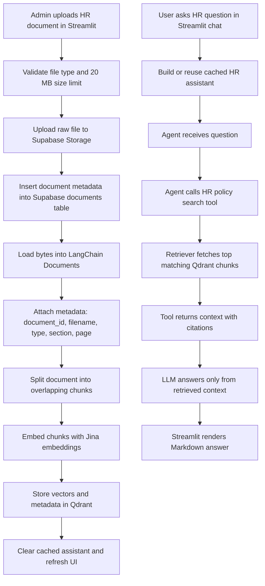

# HR Assistant Design

This document describes the design of the HR Assistant project. The system is a retrieval-augmented HR policy assistant: administrators upload policy documents, the application indexes those documents into Qdrant, and employees ask questions that are answered only from retrieved policy context.

The active production path uses Streamlit, Supabase, Qdrant, Jina embeddings, Groq, and LangChain. Supabase stores uploaded files and document metadata. Qdrant stores searchable document chunks and their citation metadata.

## 1. Architecture

The project is organized around a small Streamlit application and an `assistant/` package. Streamlit owns the user interface. The assistant package owns storage, document loading, chunking, retrieval, model setup, and agent orchestration.

Main components:

- `app.py`: Streamlit UI for admin uploads, document deletion, document listing, and user chat.
- `assistant/pipeline.py`: main orchestration layer for upload, index, delete, assistant build, and question answering.
- `assistant/supabase_storage.py`: Supabase Storage and `documents` metadata table operations.
- `assistant/doc_loader.py`: converts PDF, DOCX, TXT, and Markdown bytes into LangChain documents.
- `assistant/splitters.py`: splits loaded documents into overlapping chunks.
- `assistant/embeddings.py`: creates the Jina embedding model.
- `assistant/vector_store.py`: creates, loads, updates, queries, and deletes Qdrant vectors.
- `assistant/tools.py`: wraps the retriever as a LangChain tool that returns policy context with citation details.
- `assistant/llm.py`: creates the Groq chat model.
- `assistant/agent.py`: builds the LangChain agent with the HR policy system prompt and search tool.

### Flow Chart



### Upload To Index Flow

The upload path begins in `app.py` when an admin selects a supported document. The UI validates size before calling `add_uploaded_document()` in `assistant/pipeline.py`.

The pipeline first uploads the original bytes to Supabase Storage and inserts a metadata record into the Supabase `documents` table. The file is then loaded into LangChain document objects, split into chunks, embedded with Jina, and written to Qdrant.

If indexing fails after the file is uploaded, the pipeline attempts to roll back the Supabase document record and storage object. This keeps the storage layer closer to the vector layer and avoids listing files that cannot be searched.

### Query To Answer Flow

The query path begins when the user submits a chat question. `app.py` builds the assistant through `build_hr_assistant()` and caches it with `st.cache_resource`, so Qdrant, retriever, tool, LLM, and agent setup are not repeated for every message.

When the user asks a question, `ask()` invokes the LangChain agent with a message payload. The agent has one tool: `search_hr_policy_with_context`. That tool searches Qdrant through the retriever, formats the matching chunks with citation metadata, and returns them to the model. The system prompt requires the final answer to use only this retrieved context.

## 2. Chunking And Retrieval

Documents are split with `RecursiveCharacterTextSplitter`. The current configuration is:

- chunk size: `1000`
- chunk overlap: `150`
- retriever top-k: `5`

These values are defined in `assistant/config.py`.

The chunk size is large enough to preserve policy paragraphs, table-adjacent explanations, and eligibility conditions that often need nearby context. The overlap helps avoid losing meaning when a relevant policy spans a chunk boundary. For HR policy text, this is usually more useful than very tiny chunks, because a single answer often depends on a condition, limit, and exception appearing close together.

Each loaded document receives metadata before chunking:

- `document_id`: generated UUID from the Supabase metadata record.
- `filename`: original uploaded file name.
- `document_type`: file extension such as `.pdf`, `.docx`, `.txt`, or `.md`.
- `source_type`: currently `admin_upload`.
- `section`: human-readable section name.
- `page_number`: added for PDF pages when available.

For PDFs, the section is based on the page number. For Markdown, the loader extracts the latest Markdown heading from the loaded text and stores it as the section. TXT and DOCX currently use `General`.

The retriever is created from the Qdrant vector store with `search_kwargs={"k": 5}`. This means the search tool returns the five most semantically relevant chunks for the user question. The goal is to give the model enough evidence to answer common policy questions without flooding it with loosely related context.

Qdrant also stores the metadata with each vector. That metadata is needed for two things:

- user-facing citations, such as document name and section
- document deletion, using the `metadata.document_id` payload filter

The vector store creates a payload index on `metadata.document_id`. That index makes it possible to delete all vectors belonging to one uploaded document when the admin removes it from the app.

## 3. Grounding

The assistant is intentionally conservative. The system prompt in `assistant/config.py` tells the model to answer using only the retrieved policy context and not to use general knowledge, assumptions, or outside information.

Grounding is enforced in three layers:

1. Retrieval gives the model only policy chunks from uploaded HR documents.
2. The search tool returns citation details with every chunk.
3. The system prompt tells the model to cite every factual claim and return an empty answer if the retrieved context is not sufficient.

This is important for HR policy because a plausible answer can still be wrong or risky. For example, a related leave policy should not be used to invent a new eligibility rule, and the absence of a restriction should not be treated as permission.

When retrieval is weak, the desired model behavior is to return an empty answer. The `ask()` function then converts an empty response into this fallback:

```text
I couldn't find enough information in the available HR policies to answer that. Please contact HR.
```

If the agent throws an exception during a Streamlit chat request, the UI displays a general error message instead. This separates unsupported policy questions from operational failures.

The answer format is Markdown. Citations are expected to use the human-readable format:

```text
[Source: Document Name — Section Name]
```

Source IDs are kept inside tool context for traceability, but they are not intended to be the user-facing citation format.

## 4. Schema And APIs

This project does not expose a public HTTP API. The "APIs" are internal Python function boundaries and external service schemas.

### Upload Request

`app.py` sends uploaded file data into the pipeline:

```python
add_uploaded_document(
    filename=uploaded_file.name,
    file_bytes=uploaded_file.getvalue(),
)
```

The shape is intentionally small. The UI owns Streamlit's uploaded file object, while the pipeline only needs a filename and raw bytes. This keeps the pipeline testable outside Streamlit.

### Upload Response

`add_uploaded_document()` returns the Supabase metadata record:

```python
{
    "id": "document UUID",
    "filename": "Benefits Policy.pdf",
    "storage_path": "documents/<document_id>/Benefits Policy.pdf",
    "file_type": ".pdf",
    "file_size": 123456,
    "uploaded_at": "ISO timestamp"
}
```

This schema supports listing, deleting, and connecting Supabase records to Qdrant vectors.

### Document Metadata Table

The Supabase `documents` table is expected to store:

```text
id
filename
storage_path
file_type
file_size
uploaded_at
```

The `id` is the shared key between Supabase metadata and Qdrant chunk metadata. That makes deletion straightforward: fetch the Supabase document, delete matching Qdrant vectors by `metadata.document_id`, then remove the Supabase file and metadata row.

### Agent Question Request

The question-answering path sends a LangChain message payload:

```python
{
    "messages": [
        {
            "role": "user",
            "content": question,
        }
    ]
}
```

This matches the LangChain agent interface and keeps the app ready for future chat history support.

### Search Tool Response

The retriever tool returns plain text blocks:

```text
SOURCE 1
Citation: Benefits Policy.md — Health coverage tiers
Document: Benefits Policy.md
Section: Health coverage tiers
Document ID: <document_id>

Content:
<retrieved policy text>
```

Plain text is used because the LangChain tool passes context directly to the model. The structure is still regular enough for the prompt to tell the model which fields should be used for citations.

### Final Answer Response

`ask()` returns a Markdown string:

```python
"Employees in Band B are enrolled in the Standard health tier. [Source: Benefits Policy — Health coverage tiers]"
```

Markdown is a good fit because Streamlit can render it directly, and HR answers often benefit from bullets, tables, short headings, and inline citations.

## 5. Trade-Offs

### Qdrant And Supabase Instead Of Local Files

A local-only store is simpler during prototyping, but it does not fit a document management workflow very well. Uploaded files need durable storage, metadata listing, deletion, and a vector database that can be queried and filtered consistently.

Supabase was chosen for file storage and document metadata. Qdrant was chosen for vector search and metadata-filtered deletion. This split keeps original files and vector chunks in systems designed for those jobs.

### Synchronous Indexing Instead Of A Background Queue

The current app indexes documents during the upload request. This is easy to understand and gives the admin immediate feedback. It also keeps the project small.

The rejected alternative is a background job queue. A queue would be better for large files, many concurrent uploads, retries, progress tracking, and production scale. For the current project size, synchronous indexing is acceptable, but it can make uploads feel slow and can fail inside the UI request path.

### 1000 Character Chunks With 150 Character Overlap

Smaller chunks can improve precision, but they often lose the policy conditions around an answer. Larger chunks preserve context, but they may retrieve more irrelevant text and leave less room for multiple sources.

The current `1000` and `150` settings are a middle ground. They keep related HR policy text together while still allowing the retriever to return several focused chunks.

### Strict Grounding Instead Of Helpful Guessing

The assistant is designed to say nothing or fall back when policy context is insufficient. A more conversational assistant could use general HR knowledge, but that would be risky for internal policy questions.

The strict approach can feel less helpful when retrieval misses the right chunk. The benefit is that answers are less likely to invent permissions, benefits, exceptions, or restrictions.

## 6. If There Were Two More Weeks

The first hardening priority would be evaluation. A small test set of realistic HR questions should verify answer correctness, citation quality, refusal behavior, and retrieval coverage. This would catch cases where the model answers from weak evidence or fails to cite the exact policy section.

The second priority would be authentication and authorization. Admin upload/delete actions should be restricted, and employee access should be tied to the organization's identity provider. Supabase row-level security and separate service roles should be reviewed before wider deployment.

The third priority would be ingestion quality. PDF tables, scanned documents, complex DOCX formatting, and section extraction need stronger handling. Better table extraction would matter for benefits limits, eligibility matrices, and policy schedules.

The fourth priority would be operational resilience. Upload indexing should move to a background job with status tracking, retries, and partial-failure recovery. Health checks should be added for Supabase, Qdrant, Jina, and Groq.

The fifth priority would be feedback and auditability. Users should be able to mark answers as helpful or incorrect, and admins should be able to inspect which chunks were used for an answer. This would make it easier to improve retrieval, prompts, and document coverage over time.
