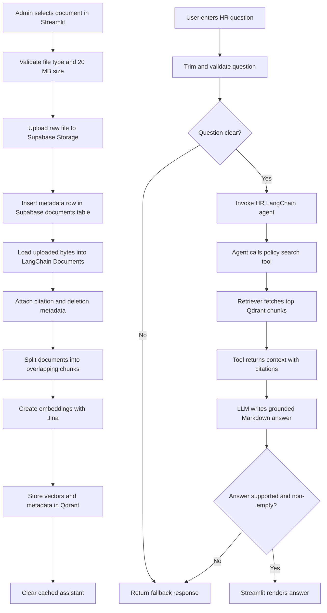

# HR Assistant Design

This document explains the current design of the HR Assistant project. The application is a retrieval-augmented policy assistant: HR documents are uploaded, stored, chunked, embedded, indexed, retrieved, and used as the only source for answers.

The current implementation uses Streamlit, Supabase, Qdrant, Jina embeddings, Groq, and LangChain. Supabase stores original files and metadata. Qdrant stores searchable chunk vectors and metadata. The model is instructed to answer only when retrieved policy context directly supports the user's question.

## 1. Architecture

The app has one UI process and a small set of backend modules inside the `assistant/` package.

Core components:

- `app.py`: Streamlit interface for uploading, deleting, listing, chatting, and rendering answers.
- `assistant/pipeline.py`: orchestration layer for upload/index, delete, assistant construction, question validation, and answer generation.
- `assistant/supabase_storage.py`: Supabase Storage and Supabase `documents` table access.
- `assistant/doc_loader.py`: file-type-specific document loading.
- `assistant/splitters.py`: chunking with `RecursiveCharacterTextSplitter`.
- `assistant/embeddings.py`: Jina embedding model creation.
- `assistant/vector_store.py`: Qdrant collection, indexing, retrieval, and deletion.
- `assistant/tools.py`: LangChain search tool over Qdrant retrieval results.
- `assistant/llm.py`: Groq chat model setup.
- `assistant/agent.py`: LangChain agent setup with the HR grounding prompt.

### Flow Chart



### Upload To Index Data Flow

The upload flow starts in `app.py`. The admin selects a document in the sidebar, and Streamlit checks that the file is no larger than 20 MB. Supported extensions are `.pdf`, `.docx`, `.txt`, and `.md`.
# HR Assistant Design

This document explains the current design of the HR Assistant project. The application is a retrieval-augmented policy assistant: HR documents are uploaded, stored, chunked, embedded, indexed, retrieved, and used as the only source for answers.

The current implementation uses Streamlit, Supabase, Qdrant, Jina embeddings, Groq, and LangChain. Supabase stores original files and metadata. Qdrant stores searchable chunk vectors and metadata. The model is instructed to answer only when retrieved policy context directly supports the user's question.

## 1. Architecture

The app has one UI process and a small set of backend modules inside the `assistant/` package.

Core components:

- `app.py`: Streamlit interface for uploading, deleting, listing, chatting, and rendering answers.
- `assistant/pipeline.py`: orchestration layer for upload/index, delete, assistant construction, question validation, and answer generation.
- `assistant/supabase_storage.py`: Supabase Storage and Supabase `documents` table access.
- `assistant/doc_loader.py`: file-type-specific document loading.
- `assistant/splitters.py`: chunking with `RecursiveCharacterTextSplitter`.
- `assistant/embeddings.py`: Jina embedding model creation.
- `assistant/vector_store.py`: Qdrant collection, indexing, retrieval, and deletion.
- `assistant/tools.py`: LangChain search tool over Qdrant retrieval results.
- `assistant/llm.py`: Groq chat model setup.
- `assistant/agent.py`: LangChain agent setup with the HR grounding prompt.

### Flow Chart


### Upload To Index Data Flow

The upload flow starts in `app.py`. The admin selects a document in the sidebar, and Streamlit checks that the file is no larger than 20 MB. Supported extensions are `.pdf`, `.docx`, `.txt`, and `.md`.

The UI then calls:

```python
add_uploaded_document(filename, file_bytes)
```

The pipeline uploads the raw file to Supabase Storage first. It also inserts a metadata row in the Supabase `documents` table. That metadata row creates the `document_id` used later in Qdrant metadata.

After storage succeeds, the same uploaded bytes are loaded into LangChain document objects. The loader adds document metadata, the splitter creates chunks, Jina creates embeddings, and Qdrant stores the chunk vectors with metadata.

If indexing fails after the Supabase upload, the pipeline attempts to roll back the Supabase file and metadata through `delete_document(document_id)`. This prevents a document from appearing in the admin list when it cannot be searched.

### Query To Answer Data Flow

The query flow starts when a user sends a chat message. `ask()` first checks for an empty string and returns fallback when the question has no content.

For non-empty questions, the pipeline creates a validation LLM and calls `is_question_clear()`. The validation prompt is intentionally strict. It returns `True` only when the LLM response is exactly `YES`; every other response is treated as unclear.

Clear questions are sent to the HR policy agent. The agent can call one tool, `search_hr_policy_with_context`, which retrieves the top matching policy chunks from Qdrant and returns each chunk with citation fields. The final model response is extracted from the LangChain agent messages.

If the agent fails, returns an unexpected response shape, or returns an empty answer, `ask()` returns the fallback response.

## 2. Chunking And Retrieval

Documents are chunked with `RecursiveCharacterTextSplitter`.

Current settings:

```text
CHUNK_SIZE = 1000
CHUNK_OVERLAP = 150
TOP_K_RESULTS = 5
```

The chunk size is chosen to keep nearby policy conditions together. HR policies often place a rule, limit, exception, and eligibility condition in adjacent text or table rows. Very small chunks can separate those pieces and make answers less reliable.

The overlap reduces boundary loss. If a paragraph or table explanation crosses a chunk boundary, overlap gives the retriever another chance to fetch enough context.

The retriever uses Qdrant through LangChain:

```python
vector_store.as_retriever(search_kwargs={"k": 5})
```

Returning five chunks is a practical balance. It gives the model enough context for direct fact questions and structured policy lookups without sending too much loosely related text.

### Stored Metadata

Each loaded document stores metadata before chunking:

```text
document_id
filename
document_type
source_type
section
page_number
```

`document_id` is the UUID generated for the Supabase metadata row. It connects Supabase and Qdrant. When a document is deleted, Qdrant points are removed by filtering on `metadata.document_id`.

`filename` and `section` are used for citations. The system prompt requires citations in this format:

```text
[Source: Document Name — Section Name]
```

`page_number` is added for PDFs when loader metadata includes a page. For Markdown files, `section` is inferred from headings. TXT and DOCX files currently use `General`.

### Why Qdrant Metadata Matters

Qdrant does more than store embeddings. It also stores metadata payloads with each chunk. This project uses that metadata for:

- citation formatting
- document-level deletion
- traceability from answer back to uploaded document

The vector store creates a payload index on:

```text
metadata.document_id
```

That index is required for efficient filtered deletion.

## 3. Grounding

The assistant is designed to avoid policy invention. It should answer only when uploaded policy context directly supports the user's question.

Grounding happens in several steps:

1. Question validation rejects unclear, ambiguous, malformed, or incomplete questions before retrieval.
2. The HR agent receives a system prompt that forbids outside knowledge and unsupported assumptions.
3. The agent must use retrieved policy context from the Qdrant search tool.
4. The prompt requires citations for factual claims.
5. Empty or unsupported answers are converted to fallback.

The system prompt also handles common policy risks. It tells the model not to treat absence of a prohibition as permission. It also says that related concepts are not enough. A policy about fitness equipment, for example, should not automatically answer a question about a personal home gym expense unless the retrieved policy explicitly supports that exact conclusion.

### Expected Behaviors

For a direct fact question, the assistant should return the exact value and cite the specific source.

Example:

```text
Question: What is the casual leave carry-forward limit?
Expected: The correct number, with a citation.
```

For a structured policy or table lookup, the assistant should identify the relevant row and column, answer the specific cell, and cite the table source.

Example:

```text
Question: Does the Standard health tier cover dental implants?
Expected: The value from the Standard row and Dental implants column, with a citation.
```

For an unknown, unclear, or weakly supported question, the assistant should not guess. It should return fallback and point the user to HR.

Example:

```text
Question: Can I expense a personal home gym?
Expected: Fallback unless the retrieved policy directly answers that exact question.
```

The fallback response is:

```text
I couldn't find enough information in the available HR policies to answer that. Please contact HR.
```

## 4. Schema And APIs

The project does not expose a public HTTP API. The schemas below are internal Python boundaries and service record shapes.

### Upload Request

The Streamlit upload flow calls:

```python
add_uploaded_document(
    filename=uploaded_file.name,
    file_bytes=uploaded_file.getvalue(),
)
```

This schema keeps Streamlit-specific objects out of the pipeline. The pipeline only needs stable primitives: a file name and bytes.

### Upload Response

The upload pipeline returns the Supabase metadata dictionary:

```python
{
    "id": "document UUID",
    "filename": "policy.pdf",
    "storage_path": "documents/<document_id>/policy.pdf",
    "file_type": ".pdf",
    "file_size": 123456,
    "uploaded_at": "ISO timestamp",
}
```

This shape supports admin listing, deletion, and the connection between storage records and Qdrant vectors.

### Supabase Documents Table

The app expects a `documents` table with:

```text
id
filename
storage_path
file_type
file_size
uploaded_at
```

The `id` is the shared document identifier. It appears in Supabase metadata and in Qdrant chunk metadata.

### Qdrant Payload

Each Qdrant chunk stores the text vector plus metadata similar to:

```python
{
    "metadata": {
        "document_id": "<document_id>",
        "filename": "policy.pdf",
        "document_type": ".pdf",
        "source_type": "admin_upload",
        "section": "Page 1",
        "page_number": 1,
    },
    "page_content": "policy chunk text"
}
```

The exact Qdrant storage shape is handled by LangChain's `QdrantVectorStore`, but these are the meaningful application fields.

### Question Validation Request

Before retrieval, `ask()` calls:

```python
is_question_clear(validation_llm, question)
```

The validation LLM receives a prompt that asks for only one word:

```text
YES
```

or:

```text
NO
```

Only an exact `YES` allows the question to reach the HR agent. This schema is intentionally strict because ambiguous questions should not be repaired or guessed.

### Agent Request

Clear questions are sent to the LangChain agent as messages:

```python
{
    "messages": [
        {
            "role": "user",
            "content": question,
        }
    ]
}
```

The message shape matches LangChain's agent interface and leaves room for future conversation history.

### Search Tool Response

The retriever tool returns plain text blocks:

```text
SOURCE 1
Citation: Benefits Policy.md — Health coverage tiers
Document: Benefits Policy.md
Section: Health coverage tiers
Document ID: <document_id>

Content:
<retrieved policy text>
```

Plain text is easy for the model to consume, while the labels make citation fields clear.

### Final Answer

The final app-level response is a Markdown string:

```python
"The Standard health tier does not cover dental implants. [Source: Benefits Policy — Health coverage tiers]"
```

Markdown is used because Streamlit renders it directly, and policy answers often need bullets, tables, short headings, and inline citations.

## 5. Trade-Offs

### Qdrant And Supabase Instead Of Local Storage

A local vector index and local file storage are easy for early experiments, but they do not fit the current app requirements. The admin needs durable uploaded files, a document list, deletion, and a retrievable vector store with metadata filtering.

Supabase was chosen for file storage and metadata. Qdrant was chosen for vector search and document-level vector deletion. This separates original document storage from semantic retrieval.

### Synchronous Upload Indexing Instead Of Background Jobs

The current implementation indexes during the Streamlit upload request. This is simple and gives immediate success or failure feedback.

The rejected alternative is asynchronous indexing through a queue. A queue would improve responsiveness, retry behavior, and large-file handling, but it would also add worker infrastructure and status tracking. For this project stage, synchronous indexing keeps the system easier to reason about.

### Strict Question Validation Instead Of Lenient Interpretation

The pipeline now validates questions before retrieval. This rejects vague prompts such as "Is this covered?" or "What about gym?" instead of guessing the user's intent from keywords.

The trade-off is that some short but understandable user questions may be rejected. The benefit is safer HR behavior: unclear questions do not reach retrieval and cannot produce confident but unsupported policy answers.

### 1000 Character Chunks Instead Of Very Small Chunks

Very small chunks can improve narrow matching, but they can split policy rules from their exceptions or limits. Very large chunks preserve context but may dilute retrieval precision.

The current `1000` character chunk size with `150` overlap is a middle ground. It keeps related HR policy text together while allowing Qdrant to return several relevant chunks.

### Empty Model Answer Plus App Fallback

The system prompt asks the model to return an empty answer when context is insufficient. The application then converts empty answers into a user-facing fallback message.

This keeps the model prompt focused on evidence and keeps the user experience friendly. The rejected alternative is asking the model to explain every refusal, which can accidentally include unsupported policy reasoning.

## 6. If There Were Two More Weeks

The first hardening priority would be evaluation. The app needs a small test set covering direct facts, table lookups, ambiguous questions, off-policy questions, weak retrieval, and citation correctness.

The second priority would be authentication and authorization. Upload and delete actions should be admin-only, and user access should be tied to company identity. Supabase permissions and service role usage should be tightened before production deployment.

The third priority would be ingestion quality. PDF tables, scanned PDFs, DOCX section headings, and complex policy tables need more reliable extraction. This matters for HR policies where a single answer can depend on a table cell.

The fourth priority would be asynchronous indexing. Large documents should be processed in the background with progress status, retries, and clear failure states.

The fifth priority would be observability and feedback. The app should log retrieved chunk IDs, validation decisions, fallback reasons, and user feedback so retrieval quality and prompt behavior can be improved safely.

The sixth priority would be admin tooling. Admins should be able to inspect indexed documents, re-index a document, see chunk counts, and verify that citations point to the expected sections.

The UI then calls:

```python
add_uploaded_document(filename, file_bytes)
```

The pipeline uploads the raw file to Supabase Storage first. It also inserts a metadata row in the Supabase `documents` table. That metadata row creates the `document_id` used later in Qdrant metadata.

After storage succeeds, the same uploaded bytes are loaded into LangChain document objects. The loader adds document metadata, the splitter creates chunks, Jina creates embeddings, and Qdrant stores the chunk vectors with metadata.

If indexing fails after the Supabase upload, the pipeline attempts to roll back the Supabase file and metadata through `delete_document(document_id)`. This prevents a document from appearing in the admin list when it cannot be searched.

### Query To Answer Data Flow

The query flow starts when a user sends a chat message. `ask()` first checks for an empty string and returns fallback when the question has no content.

For non-empty questions, the pipeline creates a validation LLM and calls `is_question_clear()`. The validation prompt is intentionally strict. It returns `True` only when the LLM response is exactly `YES`; every other response is treated as unclear.

Clear questions are sent to the HR policy agent. The agent can call one tool, `search_hr_policy_with_context`, which retrieves the top matching policy chunks from Qdrant and returns each chunk with citation fields. The final model response is extracted from the LangChain agent messages.

If the agent fails, returns an unexpected response shape, or returns an empty answer, `ask()` returns the fallback response.

## 2. Chunking And Retrieval

Documents are chunked with `RecursiveCharacterTextSplitter`.

Current settings:

```text
CHUNK_SIZE = 1000
CHUNK_OVERLAP = 150
TOP_K_RESULTS = 5
```

The chunk size is chosen to keep nearby policy conditions together. HR policies often place a rule, limit, exception, and eligibility condition in adjacent text or table rows. Very small chunks can separate those pieces and make answers less reliable.

The overlap reduces boundary loss. If a paragraph or table explanation crosses a chunk boundary, overlap gives the retriever another chance to fetch enough context.

The retriever uses Qdrant through LangChain:

```python
vector_store.as_retriever(search_kwargs={"k": 5})
```

Returning five chunks is a practical balance. It gives the model enough context for direct fact questions and structured policy lookups without sending too much loosely related text.

### Stored Metadata

Each loaded document stores metadata before chunking:

```text
document_id
filename
document_type
source_type
section
page_number
```

`document_id` is the UUID generated for the Supabase metadata row. It connects Supabase and Qdrant. When a document is deleted, Qdrant points are removed by filtering on `metadata.document_id`.

`filename` and `section` are used for citations. The system prompt requires citations in this format:

```text
[Source: Document Name — Section Name]
```

`page_number` is added for PDFs when loader metadata includes a page. For Markdown files, `section` is inferred from headings. TXT and DOCX files currently use `General`.

### Why Qdrant Metadata Matters

Qdrant does more than store embeddings. It also stores metadata payloads with each chunk. This project uses that metadata for:

- citation formatting
- document-level deletion
- traceability from answer back to uploaded document

The vector store creates a payload index on:

```text
metadata.document_id
```

That index is required for efficient filtered deletion.

## 3. Grounding

The assistant is designed to avoid policy invention. It should answer only when uploaded policy context directly supports the user's question.

Grounding happens in several steps:

1. Question validation rejects unclear, ambiguous, malformed, or incomplete questions before retrieval.
2. The HR agent receives a system prompt that forbids outside knowledge and unsupported assumptions.
3. The agent must use retrieved policy context from the Qdrant search tool.
4. The prompt requires citations for factual claims.
5. Empty or unsupported answers are converted to fallback.

The system prompt also handles common policy risks. It tells the model not to treat absence of a prohibition as permission. It also says that related concepts are not enough. A policy about fitness equipment, for example, should not automatically answer a question about a personal home gym expense unless the retrieved policy explicitly supports that exact conclusion.

### Expected Behaviors

For a direct fact question, the assistant should return the exact value and cite the specific source.

Example:

```text
Question: What is the casual leave carry-forward limit?
Expected: The correct number, with a citation.
```

For a structured policy or table lookup, the assistant should identify the relevant row and column, answer the specific cell, and cite the table source.

Example:

```text
Question: Does the Standard health tier cover dental implants?
Expected: The value from the Standard row and Dental implants column, with a citation.
```

For an unknown, unclear, or weakly supported question, the assistant should not guess. It should return fallback and point the user to HR.

Example:

```text
Question: Can I expense a personal home gym?
Expected: Fallback unless the retrieved policy directly answers that exact question.
```

The fallback response is:

```text
I couldn't find enough information in the available HR policies to answer that. Please contact HR.
```

## 4. Schema And APIs

The project does not expose a public HTTP API. The schemas below are internal Python boundaries and service record shapes.

### Upload Request

The Streamlit upload flow calls:

```python
add_uploaded_document(
    filename=uploaded_file.name,
    file_bytes=uploaded_file.getvalue(),
)
```

This schema keeps Streamlit-specific objects out of the pipeline. The pipeline only needs stable primitives: a file name and bytes.

### Upload Response

The upload pipeline returns the Supabase metadata dictionary:

```python
{
    "id": "document UUID",
    "filename": "policy.pdf",
    "storage_path": "documents/<document_id>/policy.pdf",
    "file_type": ".pdf",
    "file_size": 123456,
    "uploaded_at": "ISO timestamp",
}
```

This shape supports admin listing, deletion, and the connection between storage records and Qdrant vectors.

### Supabase Documents Table

The app expects a `documents` table with:

```text
id
filename
storage_path
file_type
file_size
uploaded_at
```

The `id` is the shared document identifier. It appears in Supabase metadata and in Qdrant chunk metadata.

### Qdrant Payload

Each Qdrant chunk stores the text vector plus metadata similar to:

```python
{
    "metadata": {
        "document_id": "<document_id>",
        "filename": "policy.pdf",
        "document_type": ".pdf",
        "source_type": "admin_upload",
        "section": "Page 1",
        "page_number": 1,
    },
    "page_content": "policy chunk text"
}
```

The exact Qdrant storage shape is handled by LangChain's `QdrantVectorStore`, but these are the meaningful application fields.

### Question Validation Request

Before retrieval, `ask()` calls:

```python
is_question_clear(validation_llm, question)
```

The validation LLM receives a prompt that asks for only one word:

```text
YES
```

or:

```text
NO
```

Only an exact `YES` allows the question to reach the HR agent. This schema is intentionally strict because ambiguous questions should not be repaired or guessed.

### Agent Request

Clear questions are sent to the LangChain agent as messages:

```python
{
    "messages": [
        {
            "role": "user",
            "content": question,
        }
    ]
}
```

The message shape matches LangChain's agent interface and leaves room for future conversation history.

### Search Tool Response

The retriever tool returns plain text blocks:

```text
SOURCE 1
Citation: Benefits Policy.md — Health coverage tiers
Document: Benefits Policy.md
Section: Health coverage tiers
Document ID: <document_id>

Content:
<retrieved policy text>
```

Plain text is easy for the model to consume, while the labels make citation fields clear.

### Final Answer

The final app-level response is a Markdown string:

```python
"The Standard health tier does not cover dental implants. [Source: Benefits Policy — Health coverage tiers]"
```

Markdown is used because Streamlit renders it directly, and policy answers often need bullets, tables, short headings, and inline citations.

## 5. Trade-Offs

### Qdrant And Supabase Instead Of Local Storage

A local vector index and local file storage are easy for early experiments, but they do not fit the current app requirements. The admin needs durable uploaded files, a document list, deletion, and a retrievable vector store with metadata filtering.

Supabase was chosen for file storage and metadata. Qdrant was chosen for vector search and document-level vector deletion. This separates original document storage from semantic retrieval.

### Synchronous Upload Indexing Instead Of Background Jobs

The current implementation indexes during the Streamlit upload request. This is simple and gives immediate success or failure feedback.

The rejected alternative is asynchronous indexing through a queue. A queue would improve responsiveness, retry behavior, and large-file handling, but it would also add worker infrastructure and status tracking. For this project stage, synchronous indexing keeps the system easier to reason about.

### Strict Question Validation Instead Of Lenient Interpretation

The pipeline now validates questions before retrieval. This rejects vague prompts such as "Is this covered?" or "What about gym?" instead of guessing the user's intent from keywords.

The trade-off is that some short but understandable user questions may be rejected. The benefit is safer HR behavior: unclear questions do not reach retrieval and cannot produce confident but unsupported policy answers.

### 1000 Character Chunks Instead Of Very Small Chunks

Very small chunks can improve narrow matching, but they can split policy rules from their exceptions or limits. Very large chunks preserve context but may dilute retrieval precision.

The current `1000` character chunk size with `150` overlap is a middle ground. It keeps related HR policy text together while allowing Qdrant to return several relevant chunks.

### Empty Model Answer Plus App Fallback

The system prompt asks the model to return an empty answer when context is insufficient. The application then converts empty answers into a user-facing fallback message.

This keeps the model prompt focused on evidence and keeps the user experience friendly. The rejected alternative is asking the model to explain every refusal, which can accidentally include unsupported policy reasoning.

## 6. If There Were Two More Weeks

The first hardening priority would be evaluation. The app needs a small test set covering direct facts, table lookups, ambiguous questions, off-policy questions, weak retrieval, and citation correctness.

The second priority would be authentication and authorization. Upload and delete actions should be admin-only, and user access should be tied to company identity. Supabase permissions and service role usage should be tightened before production deployment.

The third priority would be ingestion quality. PDF tables, scanned PDFs, DOCX section headings, and complex policy tables need more reliable extraction. This matters for HR policies where a single answer can depend on a table cell.

The fourth priority would be asynchronous indexing. Large documents should be processed in the background with progress status, retries, and clear failure states.

The fifth priority would be observability and feedback. The app should log retrieved chunk IDs, validation decisions, fallback reasons, and user feedback so retrieval quality and prompt behavior can be improved safely.

The sixth priority would be admin tooling. Admins should be able to inspect indexed documents, re-index a document, see chunk counts, and verify that citations point to the expected sections.
